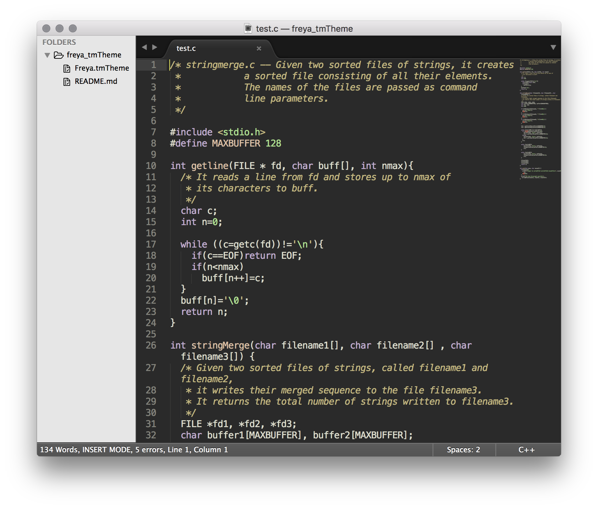

Freya
=====

Sublime Text / TextMate theme adapted from [Freya][freya], my favourite vim colour scheme. It's a lovely dark scheme with warm, low-contrast colours that looks like this:

Credits
-------

Freya is originally by [Georg Dahn](http://www.vim.org/account/profile.php?user_id=6642).

[freya]: http://www.vim.org/scripts/script.php?script_id=1651
